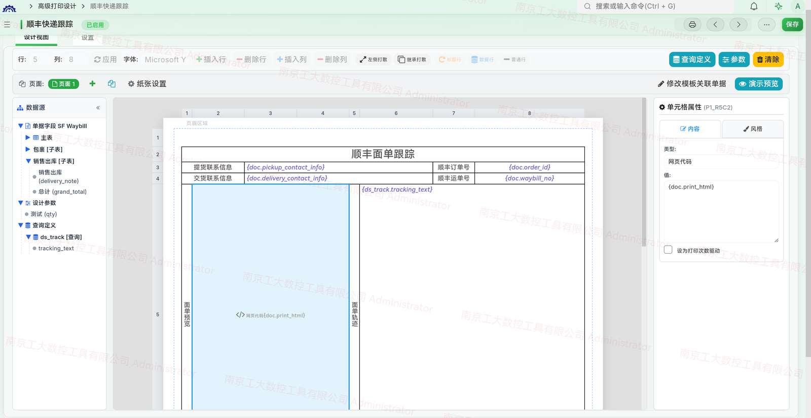
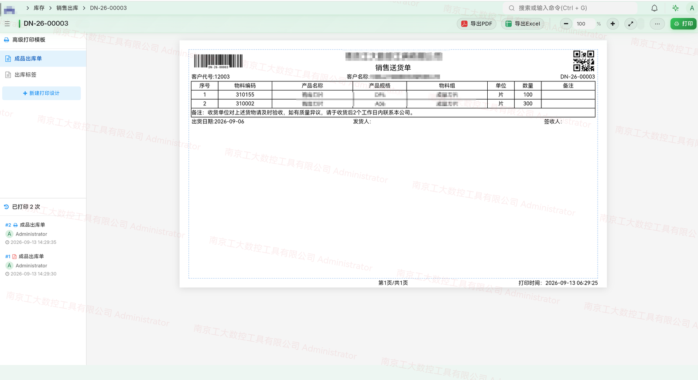
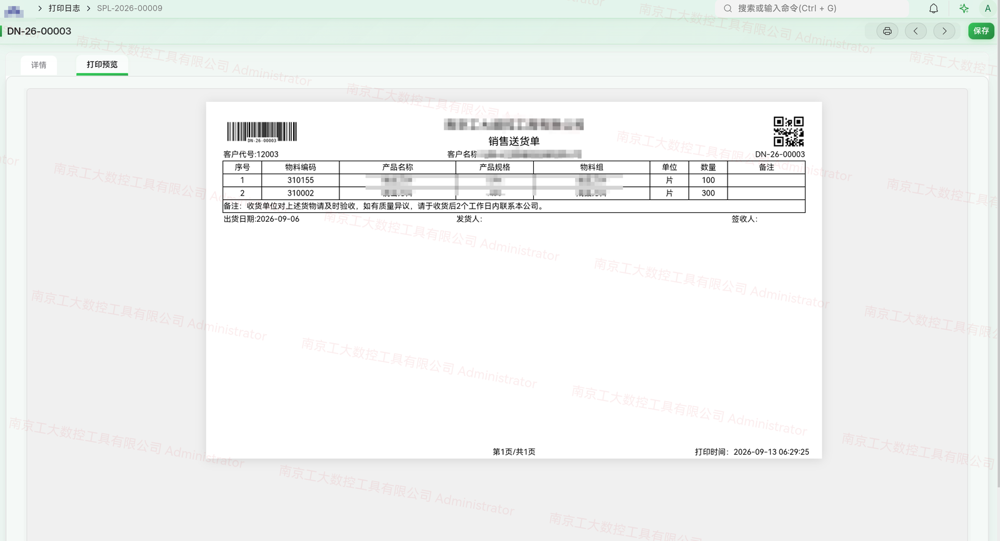
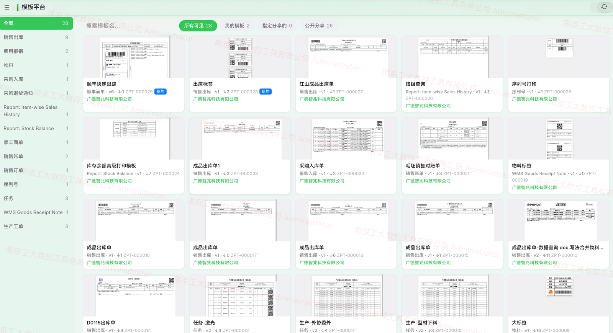

# zhiz_print · Advanced Print Designer — User Guide

> **Maintained by** **Guangde Zhizhao Technology Co., Ltd.** | **Developer** **Zhizhao.Huang** +8613913019935 | **Official Repo** <https://gitee.com/gdzhiz/zhiz_print>
>
> **Applies to** v15+
>
> A visual print-template designer for Frappe / ERPNext — grid design · data binding · expression evaluation · multi-engine PDF · batch printing · persistent logs.

---

## About Zhiz Print

**Zhiz Print** is a limited open-source app carved out of real production projects and maintained long-term by **Guangde Zhizhao Technology Co., Ltd.**, with developer **Zhizhao.Huang** (Gitee [@gdzhiz](https://gitee.com/gdzhiz)) iterating full-time.

- **Positioning**: a dedicated app for **complex print layouts** on ERPNext / Frappe — WYSIWYG grid design focused on multi-page layouts, cell merging, expression evaluation, barcodes/QR codes, and multi-engine PDF export
- **Official repo**: <https://gitee.com/gdzhiz/zhiz_print> (the only official source; all others are community forks)
- **GitHub mirror**: <https://github.com/yowlion/zhiz_print> (auto-synced from the Gitee official source)
- **The open-source edition shares the same codebase as the commercial edition of Guangde Zhizhao Technology Co., Ltd. — installing on any server automatically grants a 10-year license key**
- **License**: Copyright © 2026 Guangde Zhizhao Technology Co., Ltd. All rights reserved — see [LICENSE](LICENSE)

---

## Contents

1. [Overview & Architecture](#1-overview--architecture)
2. [Install & Enable](#2-install--enable)
3. [Designer Basics](#3-designer-basics)
4. [Data Binding (Placeholders)](#4-data-binding-placeholders)
5. [Cell Value Semantics (two kinds)](#5-cell-value-semantics-two-kinds)
6. [Row Control & Sorting](#6-row-control--sorting)
7. [Display Types (cell_type)](#7-display-types-cell_type)
8. [Pagination & Multi-Page Design](#8-pagination--multi-page-design)
9. [Header / Footer / Side Strips](#9-header--footer--side-strips)
10. [Enable Condition](#10-enable-condition)
11. [Draft Blocking](#11-draft-blocking)
12. [Output (Preview / PDF / Excel / Batch)](#12-output-preview--pdf--excel--batch)
13. [Print Log](#13-print-log)
14. [Global Settings](#14-global-settings-zprint-setting)
15. [Template Platform](#15-template-platform)
16. [Appendix · Cheat Sheet & FAQ](#16-appendix--cheat-sheet--faq)

---

## 1. Overview & Architecture

zhiz_print designs print layouts on a grid: cell merging, unified value semantics (placeholders / `=` expressions / `=` conditions / totals), per-column sorting, automatic pagination, QR/barcode/image cells, plus multi-engine PDF / Excel export. Every print action is recorded as a persistent log (with a render snapshot that never changes with later design edits).

Since v15.22 it also supports **report printing**: set the design target to "Report" and design print templates for ERPNext reports (Query Report / Script Report, e.g. Stock Balance / General Ledger) — bind report rows with `rep` placeholders, put filters into headers, design totals yourself with `=rowsum()`. Reports share the same rendering / pagination / output pipeline as documents.

### Data Flow

| Stage | Description | Key code |
|---|---|---|
| **1. Data** | Document mode: read main fields, child tables (e.g. `items`), custom queries (`design_queries`) and user parameters (`param`) from the target doc. Report mode: run the report query synchronously as the current user; rows are injected as the `__report_main__` pseudo-query | `frappe.get_doc` · `_execute_query_with_doc_context` · `zhiz_print.api.report_print._run_report` |
| **2. Evaluation** | Value semantics (unified static): placeholder replacement, `=` arithmetic/conditional expressions (same context: doc/row/get_value/fmt), `=rowsum()` totals | `_eval_expression_cell` · `_eval_rowsum` |
| **3. Rendering** | Expand data-driven rows → sort by row-level `sorts` → compute column values → client-measured pagination → assemble HTML | `_build_expanded_rows_v2` · `_build_row_html` · `build_measurement_html` |
| **4. Output** | Print preview / PDF (wkhtmltopdf · WeasyPrint · Chromium) / Excel (openpyxl) / batch | `render_print_preview` · `generate_print_pdf` · `export_print_excel` |

### DocTypes

| DocType | Kind | Purpose |
|---|---|---|
| Super Print Design | Main | Print template design (grid + cells + styles) |
| Super Print Design Item | Child | Cell definition (row/col/span/type/value/**page_no**) |
| Super Print Design Parameter | Child | Print parameters (filled in a pre-print dialog) |
| Super Print Design Query | Child | Data query definition (SQL / function) |
| Super Print Paper | Main | Paper size (mm) |
| Super Print Log | Main | Print log (with render snapshot) |
| Super Print Enabled Doctype | Child | Doctypes with super print enabled |
| Super Print Enabled Report | Child | Reports with report printing enabled |
| Zprint Setting | Single | Global settings (document/report print switches, PDF engine, etc.) |

---

## 2. Install & Enable

### Install

```bash
cd /home/frappe/frappe-bench
git clone git@gitee.com:gdzhiz/zhiz_print.git apps/zhiz_print
bench get-app zhiz_print ./apps/zhiz_print
bench --site <site-name> install-app zhiz_print
bench build
```

### Enable

1. **Zprint Setting** → check "Enable Super Print page"
2. **Super Print Paper** → define paper sizes (e.g. A4 = 210×297mm)
3. **Super Print Enabled Doctype** → add the doctypes you need (e.g. Sales Invoice)
4. **Super Print Design** → design a template; set `target_doctype` and `print_paper`
5. Open any target document, click Print → your templates appear in the left selector

### Enable Report Printing (v15.22)

1. **Zprint Setting** → "Report Printing" section → check "Enable Report Printing"
2. Enable either **All reports** or **Specific reports** (add them, e.g. Stock Balance, to the "Enabled Reports" child table)
3. Open a target report page (set filters, run it) → menu "Print" → goes straight to the advanced print preview (native PDF / export menus are hidden automatically; export lives inside the preview page)
4. "New Report Design" on the preview page → design target pre-filled as Report → start designing (see [Designer Basics · Report Mode](#report-mode-design-v1522))

> 💡 Document printing and report printing have independent switches; turning report printing off fully restores the native report menu.

---

## 3. Designer Basics



The designer is a grid editor: row numbers on the left, column letters on top, cells in the middle. The toolbar controls row/column operations, fonts and row types; selecting a row/column/cell opens the property panel on the right.

### Grid Operations

| Operation | Description |
|---|---|
| Select row / column | Click the row number / column letter → row/column property panel appears |
| Select a cell | Click a cell → cell property panel (type / value / style) |
| Insert row / column | Select a row/column, then toolbar "Insert Row" / "Insert Column" (inserts above/left of the selection) |
| Merge cells | Set `rowspan` / `colspan` in the cell property panel (covered cells are auto-marked `||MERGED::R#C#||`) |
| Resize column (new) | Hover the **right edge of a column letter** until the `↔` cursor appears, then drag to resize live (column tags sync; width in px shows beside the cursor), release to commit |

### Datasource Sidebar · Drag-Drop Binding (v15.22.36+)

A **collapsible 180px sidebar** on the left shows the five kinds of data sources for the current design — the **standard entry point for placeholders**:

| Group | Contents |
|---|---|
| Document fields | `doc` main-table fields (grouped under a virtual "**Main Table**" group) + each **child table's** fields (sibling groups) |
| Report fields | `rep` report fields / filters / data columns (report mode) |
| Design parameters | defined `param` parameters |
| Data queries | result columns of each query |

- **Drag a leaf onto a cell** → the placeholder is generated automatically (dragging item_code yields `{doc.items.item_code}`); **double-click** a leaf as fallback (or copy)
- Field labels are shown translated (e.g. "Item Name (item_code)") in the current language
- Expanded to level 2 by default: top-level fields and Main/child-table group headers visible, leaves collapsed; click a group to fold/unfold; fully folded it shrinks to a 28px icon strip
- Loads when the designer opens; auto-reloads after queries/parameters change, on save, and when the target doctype switches
- After a drop, the "Value" input in the right property panel syncs immediately

### Demo Preview (new)

The toolbar "**Demo Preview**" button renders the current grid with sample_doc data onto a real paper view (white paper on grey) without leaving the designer; click "Back to Design" to return. All editing is disabled in preview mode.

### Page Settings Entry

Besides the "Page Settings" button, **clicking blank canvas** opens page settings directly: clicking the **upper half** of the paper selects the header tab, the **lower half** selects the footer tab (see [9. Header/Footer](#9-header--footer--side-strips)).

### Report Mode Design (v15.22)

When creating a design, choose **DocType (document)** or **Report** as the design target:

- Choose Report and fill in the target report (e.g. Stock Balance); grid editing is identical to document mode
- Bind a cell via "Data Query" → select "**Report Data**"; the data-key dropdown has three groups:
  - **Report fields**: `name` / `report_name` / `ref_doctype`, etc. (properties of the report itself)
  - **Filter fields**: `filters.company` / `filters.from_date`, etc. (current report filters)
  - **Report columns**: `items.item_code` / `items.bal_qty`, etc. (report row data)
- Selecting a data key writes the placeholder into the cell instantly, e.g. choosing "Item" shows `{rep.items.item_code}`
- Data rows: set row type to "Data-Driven Row" (or it is auto-detected from `{rep.items.field}` placeholders); rows expand by report row count at print time
- Document-only features ("Sample Doc", "Draft Blocking") are hidden in report mode

### Three Core Areas (form tabs)

- **Design View** — the visual grid editor
- **Settings** — enable condition / draft blocking / priority / paper, etc.
- **Design Items** — cell detail (read-only, serialized cell data)

---

## 4. Data Binding (Placeholders)

Bind data in `cell_value` with placeholders; they are replaced with actual values at print time.

### Placeholders

| Syntax | Source | Examples |
|---|---|---|
| `{doc.field}` | main-table field of the target document | `{doc.name}` · `{doc.customer}` · `{doc.posting_date}` |
| `{doc.childtable.field}` | child-table row field (**auto-triggers data-driven rows**) | `{doc.items.item_code}` · `{doc.items.qty}` |
| `{param.name}` | parameter filled by the user before printing | `{param.remark}` |
| `{query.column}` | custom query result (first row) | `{bom_list.qty}` |
| `{rep.field}` | report fields (report mode) | `{rep.name}` · `{rep.ref_doctype}` |
| `{rep.filters.field}` | current report filter values (report mode) | `{rep.filters.company}` · `{rep.filters.from_date}` |
| `{rep.items.field}` | report row data (**auto-triggers data-driven rows**, report mode) | `{rep.items.item_code}` · `{rep.items.bal_qty}` |

### fx Method Assistant · `=` Expression Helper (v15.22.44+)

When a cell value starts with `=`, an **fx button** appears next to the "Value" input in the property panel; click it (or just type `=`) to open the **method picker**:

- **Functions only**: aggregate functions (`rowsum` / `row`) + evaluation functions (`get_value` / `max` / `min` / `round` as three separate items) + a `doc` guide entry (fields of the target document); **placeholders are excluded** — the standard entry for placeholders is dragging from the datasource sidebar
- Each item shows **name + purpose + example**; clicking inserts a guided snippet at the cursor and keeps focus for editing
- **Live filtering**: the word being typed after `=` filters the list — `=get` shows only get_value, `=row` matches rowsum / row; clearing the word restores the full list
- Smart dedup: if the value already has an `=` prefix, inserting an `=rowsum(...)` snippet strips the duplicate equals sign

### rep Placeholders (v15.22)

In report mode `rep` sits alongside `doc` / `param`, with three-level semantics:

| Form | Meaning |
|---|---|
| `{rep.name}` (single level) | report fields (Report document: name / report_name / ref_doctype / module, etc.) |
| `{rep.filters.field}` | current filter values — usable in any cell and in headers/footers, commonly in the title area (company / date range) |
| `{rep.items.field}` | current report row data — effective only inside data-driven rows; a row containing this placeholder expands automatically by report rows |

> ⚠️ `rep` is a reserved prefix — **query names must not be called rep**. Report printing strips the engine-appended total row; design totals yourself with `=rowsum()` (see [5. Cell Value Semantics](#5-cell-value-semantics-unified-on-static)).

> 💡 Rich-text fields (Text Editor type, e.g. `terms`) print as **plain text** — no HTML tags.

### Child Table → Data-Driven Rows

Any row containing a `{doc.childtable.field}` placeholder automatically becomes a **data-driven row**: it is duplicated once per child-table record. No need to set `row_type` manually.

```
{doc.items.idx}              ← row number
{doc.items.item_code}        ← item
{doc.items.qty}              ← qty
{doc.items.rate}             ← rate
{doc.items.amount}           ← amount
```

### Parameters (pre-print dialog)

Define parameters in the **design_parameters** child table; users fill them in a dialog before printing; reference with `{param.name}`.

| Parameter ID | Display Label | Type | Example use |
|---|---|---|---|
| remark | Remark | Data | free-text note at print time |
| warehouse | Warehouse | Link → Warehouse | pick a warehouse |
| copies | Copies | Int (reqd=1, default=1) | number of copies |

### Data Queries (design_queries)

When `{doc.field}` and child tables are not enough — cross-table lookups, aggregates, complex SQL — define queries in the **design_queries** child table and reference results with `{query_name.column}`.

#### Query Definition Fields (Super Print Design Query)

| Field | Description |
|---|---|
| Query Name (`query_name`) | unique id used as `{query_name.column}` |
| Python Code (`query_code`) | Python code or a function path; **the result must be assigned to `result`** |
| Parameters (`parameters`) | parameter map, one `key=value` per line |

#### Two Forms of query_code

**① frappe.qb query builder (Python code)** — assign the result to `result`

Code runs in a safe_exec sandbox exposing: `qb` · `DocType` · `desc`/`asc` · `Sum`/`Count`/`Avg`/`Max`/`Min`/`Round`/`Concat`/`Coalesce`/`Abs`/`GROUP_CONCAT` · `filters` (parameter dict). `result` must be a list (dict per row) or a dict.

```python
# Stock qty per item (filters.item_code injected from parameters)
bin = DocType("Bin")
result = (qb.from_(bin)
          .select(bin.item_code, Sum(bin.actual_qty).as_("qty"))
          .where(bin.item_code == filters.get("item_code"))
          .groupby(bin.item_code)
          .run(as_dict=True))
```

```python
# Latest 5 sales of a customer (aggregate + order + limit)
si = DocType("Sales Invoice")
result = (qb.from_(si)
          .select(si.name, si.grand_total, si.posting_date)
          .where(si.customer == filters.get("customer"))
          .orderby(si.posting_date, order=desc())
          .limit(5)
          .run(as_dict=True))
```

**② Function path (`app.module.file.function`)** — call a Python function in your project app; parameters are passed as kwargs

```
query_code: zhiz_gy.api.report.get_sales_summary
```

The function returns `list[dict]` (one dict per row) or `list[list]` (auto-named c0/c1/..). Good for complex business logic (multi-table JOINs, Python computation) kept in your app.

#### Parameters

One `key=value` per line; the value supports three forms:

```
company=Guangyou                                ← literal
company=doc.company                             ← document field (replaced at print time)
from_date={{doc.posting_date}}                  ← double-brace form (same as above)
item_code=doc.items.item_code                   ← child-table field (per expanded row)
```

Parameters are injected into the `filters` dict; read with `filters.get("key")` in query_code.

#### Referencing Query Results

**Single value (first row)** — `{query_name.column}`:

```
Current stock: {stock.qty}
This month:    {summary.total_amount}
```

**Data-driven rows (expanded by query results)** — set `query_name` + `data_key` in the cell property panel; the row expands once per result row:

| Cell config | Description |
|---|---|
| `query_name` = `bom_detail` | bound query |
| `data_key` = `item_code` | key column for row matching |
| cell_value `{bom_detail.qty}` | qty matched per expanded row |

#### Full Example: print the BOM components of a Sales Order

1. Add a query in **design_queries**:
   - query_name = `bom_detail`
   - query_code (fetch BOM items):
     ```python
     bom = DocType("BOM")
     bi = DocType("BOM Item")
     result = (qb.from_(bi)
               .select(bi.item_code, bi.qty, bi.stock_uom)
               .left_join(bom).on(bom.name == bi.parent)
               .where(bom.name == filters.get("bom_no"))
               .run(as_dict=True))
     ```
   - parameters: `bom_no=doc.bom_no`
2. **Data-driven row** cells: query_name=`bom_detail`, data_key=`item_code`
3. **Cell references**: `{bom_detail.item_code}` / `{bom_detail.qty}` / `{bom_detail.stock_uom}`

> 💡 A failed query is logged to Error Log and yields an empty result (cells render blank); printing never aborts.

---

## 5. Cell Value Semantics (two kinds)

> A cell value has only **two semantics**: plain text and `=` expression. The resolved result is then presented by a **display type** (text / barcode / QR / image / HTML) — see [7. Display Types](#7-display-types-cell_type).
>
> Since v15.22.42 all value semantics are carried by plain text: placeholders, `=` arithmetic, `=rowsum()`, `=` conditional expressions (the former "logic" type, rewritten as an `=` prefix). Legacy types data_query/logic were migrated by patch; the renderer keeps legacy channels for old exported templates.

### ① Text semantics (default)

Plain text + `{placeholders}`, replaced one by one. The inside of a placeholder picks one of **four data sources by prefix** (see [4. Data Binding](#4-data-binding-placeholders)):

| Prefix | Data source | Examples |
|---|---|---|
| `doc.` | main-table / child-table fields of the target document | `{doc.customer}` · `{doc.items.qty}` |
| `rep.` | report fields / filters / data rows (report mode) | `{rep.filters.company}` · `{rep.items.bal_qty}` |
| `query.` | result columns of a custom data query | `{bom_list.qty}` |
| `param.` | filled by the user in the pre-print dialog | `{param.remark}` |

```
Customer: {doc.customer}
Amount:  {doc.grand_total}
Remark:  {doc.items.additional_notes}
```

### ② = expression semantics

`cell_value` starting with **`=`**: everything after `=` is a **formula** that freely mixes `{}` placeholders with methods like `get_value`. Placeholders are replaced first, then the whole formula is evaluated with `safe_eval`.

**Variables & helpers**:

| Available | Description |
|---|---|
| `doc` / `row` | target document / current child-table row (inside data-driven rows) |
| `get_value(doctype, name, field)` | cross-table single-field lookup (returns a string, '' when empty) |
| `fmt(value, precision=2)` | number formatting (`str.format` is banned by safe_eval — use `fmt`) |
| `flt` · `max` · `min` · `round` | numeric helpers and builtins (safe_eval disables builtins by default; these are exposed explicitly) |

**Arithmetic** (in-row calculations):

```
={doc.items.qty}*{doc.items.weight_per_unit}     ← total weight = qty × unit weight
={doc.items.rate}*{doc.items.qty}               ← amount = rate × qty
=round({doc.items.weight_per_unit}, 4)          ← unit weight, 4 decimals
```

**Conditional expressions** (Python):

```
get_value("Item", row.item_code, "classification")     ← "classification" of the item
"Slide" if get_value("Item", row.item_code, "classification") == "Slide" else "Other"
fmt(row.qty * row.weight_per_unit, 3)
```

**Aggregate functions**:

- `=rowsum(R:C)` — sums the displayed values of column C across all expanded items of data-driven row R, for grand totals. Both ASCII and full-width parentheses are accepted.
- `=pagerowsum(R:C)` — identical usage (R = data-driven row, C = column); the only difference is the **scope**: when data spans multiple printed pages it sums only the rows shown on **the current printed page** (page subtotal).

```
=rowsum(5:7)      ← grand total of column 7 of row 5 — works even if that column is itself a =round(...) expression
=pagerowsum(5:7)  ← column 7 of row 5, current page only (page subtotal)
```

> 💡 **pagerowsum placement**: put it in a row that **repeats on every page** (row type `Repeat Title Row`) so each page evaluates its own subtotal; put `=rowsum` in a normal row after the data (appears once) for the grand total. pagerowsum in a normal row only appears (and only sums) on the first page.
>
> 📊 **Report printing (v15.22)**: the engine-appended total row is **not** included — design totals yourself with `=rowsum()` (e.g. data rows on row 8, qty in column 4 → total cell `=rowsum(8:4)`).

> ⚠️ safe_eval bans `str.format`, attribute access on `frappe.utils.*`, and builtins. Always use `fmt`/`flt`/`get_value`; never write `frappe.utils.flt(x)`.

**float / int results** are formatted by `_fmt_val` (trailing zeros stripped: `50.0 → "50"`, `5.10 → "5.1"`); **string results are shown as-is** — the fixed precision of `fmt(x, 2)` (e.g. `12.00`) is never stripped. If an empty field makes the formula invalid (e.g. `100*`), the error is logged and the original text is shown so missing data is easy to spot.

### Semantics reference

| Style | Trigger | Example | Result |
|---|---|---|---|
| Text semantics | no `=` prefix | `Customer: {doc.customer}` | placeholder replacement |
| `=` expression | starts with `=` (formula) | `={doc.items.qty}*{doc.items.rate}` | arithmetic after replacement |
| `=` conditional | starts with `=` (Python expression) | `=get_value("Item", row.item_code, "x")` | condition / cross-table lookup |
| `=rowsum(R:C)` | starts with `=rowsum` | `=rowsum(5:7)` | grand total of row R column C |
| `=pagerowsum(R:C)` | starts with `=pagerowsum` | `=pagerowsum(5:7)` | page subtotal of row R column C |

---

## 6. Row Control & Sorting

### Row Types (row_type)

| Value | Description |
|---|---|
| Normal Row (empty) | plain row, no repeat |
| Repeat Title Row | header row, **repeats on every page** |
| Data-Driven Row | expands by child-table rows |

Rows containing `{doc.childtable.field}` are auto-detected as data-driven; no manual setup needed.

### Row Display (row_display)

| Value | Description |
|---|---|
| Auto Wrap (empty) | default; text wraps, row height adapts |
| Fixed Height | fixed height, overflow hidden (`white-space:nowrap`) |
| Auto Shrink Font | shrinks font size to fit the fixed height |

### Line Spacing (new)

When row display is **Auto Wrap**, the row property panel shows "**Line Spacing**" (0–20px). Row height = `line-height: calc(1em + Npx)` — N extra pixels on top of 1em; the designer canvas and print/PDF rendering agree (WYSIWYG).

### Check-to-Print Mode (new)

Data-driven rows have a "**Data Presentation**" option in the row property panel:

| Value | Description |
|---|---|
| Auto (default) | present all child-table rows |
| Check | a **check dialog** pops up before previewing — tick rows one by one (none checked by default, at least one required) |

The selection **persists through preview / PDF / print / totals** (=rowsum sums checked rows only). Adjacent data-driven rows bound to the **same source table** share one dialog — one check drives both rows.

### Print-Count Driver Cell (new)

Cells of data-driven rows have a "**Print Count Driver**" checkbox (numeric fields only, validated on save): when checked, that column feeds print-count statistics. At most one per design; must be Int/Float/Currency (e.g. `{doc.items.qty}`); non-numeric fields (e.g. item_name) are rejected on save.

### Row-Level Sorting (new)

Select an entire **data-driven row** → the row property panel shows "**Data Sorting**" (data-driven rows only). Enter `row.N` to sort by the **rendered display value** of column N (overrides logic/expression/concatenated columns, since sorting uses final display values).

#### Syntax

```
row.3 ASC               ← ascending by column 3
row.3 ASC, row.5 DESC   ← multi-level: column 3 asc, then column 5 desc
row.1                   ← direction optional, ASC default
```

| Feature | Description |
|---|---|
| Multi-level | comma-separated, each with its own direction |
| Multiple child tables | each data-driven row sorts independently (row 5 = items, row 8 = taxes) |
| Smart typing | numbers compare numerically, strings lexicographically, blanks last |
| Sort key | the **display value** of column N (after logic/expression evaluation) |

Sorting is stored under the `sorts` key of the `row_styles` JSON:

```json
{
  "5": { "height": 20, "sorts": "row.2 ASC" },
  "6": { "height": 25 }
}
```

---

## 7. Display Types (cell_type)

> How the **resolved** cell content is presented — freely combinable with the value semantics ([5. Cell Value Semantics](#5-cell-value-semantics-two-kinds)); e.g. value `=rowsum(5:5)` with the barcode type outputs the total as a barcode.

| cell_type | Display | Extra config |
|---|---|---|
| static | **Text** (default): resolved result shown as-is (works with placeholders and `=` formulas) | — |
| barcode | barcode (**22 symbologies**, below) | `barcode_format` · `barcode_width` · `barcode_height` · `barcode_show_text` · `barcode_text_size` |
| qrcode | QR code | `barcode_width` · `barcode_height` |
| image | image; `cell_value` holds a URL or `/files/xxx.png` | — |
| html | **HTML document** (v15.22.53): value parsed and rendered as HTML | — |

### HTML (v15.22.53)

The cell value is parsed as a **complete HTML document** — for embedding third-party waybills/voucher pages in a print template (e.g. the `print_html` field of an SF Express waybill):

- **JSON auto-unwrap**: values like `[{"waybill_no": "...", "html": "<!DOCTYPE..."}]` are unwrapped element by element (the `html` key); multiple parcels stack vertically; plain HTML strings render directly
- **iframe isolation**: the document renders inside a sandboxed iframe, so its global styles (`*{margin:0}`, `@page`, …) never leak into the print page
- **1:1 mm-based scaling**: the document's declared physical size (mm) is the baseline; content scales proportionally to fit the cell and centers — resize the cell and the display follows
- **PDF compatibility**: the wkhtmltopdf and WeasyPrint engine paths expand the iframe into an inline container (CSS rules scoped by a class prefix) before rendering — print / preview / PDF stay consistent

### Barcodes (22 symbologies, v15.23)

Built on python-barcode, PNG output, **optional text under the barcode** (toggle + font size):

| Group | Symbologies | Input requirements |
|---|---|---|
| General | CODE128 · CODE39 · Codabar · NW-7 | 128/39 any text (39 uppercase); Codabar digits + start/stop chars |
| Retail | EAN-13 (incl. Guard variants) · EAN-8 (incl. Guard) · UPC-A · JAN | 12 digits auto-checksum; UPC-A 11/12 digits |
| Packaging & logistics | EAN-14 (ITF-14) · ITF · GS1-128 | EAN-14 13 digits auto-filled; ITF even digits (odd gets a leading 0); GS1-128 with application identifiers |
| Publishing | ISBN-13 · ISBN-10 · ISSN | corresponding standard numbers |
| Pharma / standards | PZN · GS1 · GTIN | corresponding codes |

- **Text option**: check "show text under barcode" + font size in cell properties (on by default, 10px); EAN/UPC retail codes show text grouped at standard positions
- **Graceful degradation**: input violating a symbology's rules (e.g. letters in EAN-13) falls back to showing the original text and logs; never a blank cell
- **Legacy compat**: old CODE128/CODE39 designs upgrade automatically with text on by default; environments without Pillow fall back to the built-in implementation (128/39 only, no text)

### Alignment (text-align)

Image / QR / barcode cells support `text-align` (write it in `css_style`). The designer demo and print preview **render identically** (fixed in v15.10.10: the demo container switched from flex to block so text-align works through inheritance).

```
css_style: text-align:right; vertical-align:middle;     ← QR right-aligned, middle
```

---

## 8. Pagination & Multi-Page Design

### 8.1 Data Pagination (automatic)

#### Repeating header rows

Set the header row to **Repeat Title Row** and it repeats on every page. Data-driven (detail) rows expand underneath.

#### Client-measured pagination (v15.10.01+) · core

zhiz_print **lets the browser measure row heights**: the first render is an unlocked "measuring scaffold"; JS reads each row's real `offsetHeight` (including wrap after fonts load), greedily packs pages, then re-renders with exact heights. Preview / print / PDF paginate identically — no more "row 12 visible in preview but cut off in PDF" estimation drift.

> 💡 An estimation fallback (`_get_row_height`) still exists for failed measurement or direct API calls — no regression.

### 8.2 Multi-Page Design (page_count) · logical pages

The **`page_count` field** (Settings, default 1) is the number of **logical pages** of a template. Use it when one print job must output several different layouts, e.g.:

- **Page 1** = delivery note (customer signs)
- **Page 2** = receipt copy (warehouse keeps)
- **Page 3** = settlement detail

Each page is an **independent grid** (own rows × columns, own cell contents); cells carry a `page_no` field marking their page.

#### How it works

| Layer | Description |
|---|---|
| Designer | a "Page" control on top switches pages (1 / 2 / …); the current page's grid is editable independently |
| Storage | every `Super Print Design Item` (cell) has a `page_no` field (1, 2, …) |
| Rendering | `build_preview_html` loops `page_no = 1..page_count`; each page builds its own `_build_cell_map_for_page(page_no)` into a `.print-page` block |
| Isolation | page-1 cells never appear on page 2 (filtered by page_no) |

#### vs. Data Pagination (important)

| Concept | Trigger | Nature |
|---|---|---|
| **Logical page (page_count)** | designer sets `page_count > 1` | layout count — each page a different layout |
| **Physical page (data pagination)** | too many data rows, auto page-break | one layout stretched across pages by data |

A logical page (e.g. page_no=1) with many data rows still **breaks into multiple physical pages** (each repeating that logical page's header rows). The two are orthogonal: `page_count × per-page data pagination = total physical pages`.

#### Example

```
page_count = 2
# Page 1 (page_no=1): delivery layout — logo + header + details + signature
# Page 2 (page_no=2): receipt layout — slim header + details + warehouse signature
```

When editing page 2 the designer shows only page_no=2 cells; new cells are tagged with the current page automatically.

> ⚠️ Single-page templates keep `page_count = 1` (default) — you can ignore this field.

---

## 9. Header / Footer / Side Strips

The four paper-edge bands (top/bottom/left/right margins) can hold the company name, page numbers, signature areas, copy marks, etc. Configure them in "Designer → Page Settings" on the right; four tabs — **Header / Footer / Left Strip / Right Strip** — and the selected paper band **flashes** to show which is active. All four areas **share one setting across pages** (single configuration, not per-page).

> The bands live inside the paper margins. Reserve margins first in "Paper / Super Print Paper" (margin_top/bottom/left/right > 0), or the bands won't render.

### 9.1 Placeholders (all four areas)

| Placeholder | Meaning | Example output |
|---|---|---|
| `{page}` | current page | 1 |
| `{pages}` | total pages | 3 |
| `{now_date}` | current date | 2026-07-02 |
| `{now_time}` | current time | 14:30:00 |
| `{date_time}` | date and time | 2026-07-02 14:30:00 |
| `{doc.field}` | document field (same as body) | SRT-2606-00117 |
| `{rep.field}` / `{rep.filters.field}` | report fields / current filters (report mode) | Guangde Zhizhao Technology Co., Ltd. |

```
Footer center:  Page {page} of {pages}
Footer right:   Printed: {date_time}
Header left:    No.: {doc.name}
```

### 9.2 Header / Footer (horizontal · top/bottom bands)

Each band splits horizontally into **left / center / right** columns; each accepts HTML with its own alignment:

| Setting | Field | Values |
|---|---|---|
| Vertical align (whole band) | `page_header_align` / `page_footer_align` | Top / Center / Bottom |
| Left column align | `page_header_left_align` / `page_footer_left_align` | Left / Center / Right |
| Center column align | `page_header_center_align` / `page_footer_center_align` | Left / Center / Right |
| Right column align | `page_header_right_align` / `page_footer_right_align` | Left / Center / Right |

```
Footer · center:  Page {page} of {pages}          (center align = Center)
Footer · right:   Printed: {date_time}            (right align = Right)
Header · left:    No.: {doc.name}                 (left align = Left)
Header vertical:  Bottom (band sits at the bottom of the margin)
```

### 9.3 Left Strip / Right Strip (vertical · left/right bands)

Text renders **vertically** (`writing-mode: vertical-rl`) along the left or right margin band. Typical use: multi-copy marks printed along the paper edge — e.g. on the right side of a delivery note: "⑴ File white ⑵ Finance red ⑶ Accounting blue ⑷ Warehouse purple ⑸ Receiver yellow".

| Setting | Field | Values |
|---|---|---|
| Horizontal align (width) | `page_left_header_h_align` / `page_right_footer_h_align` | Left (paper edge) / Center / Right (table edge) |
| Vertical align (length) | `page_left_header_v_align` / `page_right_footer_v_align` | Top / Center / Bottom |

```
Right strip content:  ⑴ File white  ⑵ Finance red  ⑶ Accounting blue  ⑷ Warehouse purple  ⑸ Receiver yellow
Right strip H-align:  Center (centered in the right band)
Right strip V-align:  Center (centered along the length)
```

### 9.4 Spaces & Layout (all areas)

All four areas **preserve consecutive spaces** (`white-space: pre-wrap`) — use spaces to push content into alignment; HTML never collapses them. In horizontal areas (header/footer) spaces are horizontal gaps; in vertical strips they are vertical gaps along the writing direction.

---

## 10. Enable Condition

Controls on which documents a template appears. Empty = always enabled. The template shows in the print selector when the expression is true.

### Variables & Helpers

| Variable | Description |
|---|---|
| `doc` | target document (all fields readable) |
| `user` | current user's email |
| `get_value` / `fmt` / `flt` | same helpers as logic cells |

JS-style operators are supported: `==` `!=` `&&` `||` `&` `|` (with spaces) are auto-converted to Python.

### Example: match templates by company + item classification

```
doc.company == 'Jiashan Guangyou Bearing Co., Ltd.'

doc.company == 'Anhui Sol Precision Technology Co., Ltd.'

doc.company == 'Guangyou' && get_value("Item", doc.production_item, "classification") == "Slide"
```

Multiple designs can attach to the same doctype; `enable_condition` routes them by company / item / status, and only matching templates show at print time.

---

## 11. Draft Blocking

Check "**Draft No Print**" to forbid printing / exporting that design on **draft documents (docstatus=0)** — preview only. Submitted documents (docstatus=1) are unaffected.

| draft_no_print | docstatus=0 (draft) | docstatus≥1 (submitted) |
|---|---|---|
| 1 (checked) | preview only; Print/PDF/Excel buttons hidden | normal |
| 0 (unchecked) | no restriction | no restriction |

For the "design still being adjusted, don't let it be misprinted as an official document" scenario.

> 📊 Draft blocking does not apply to report printing: reports are not documents and have no docstatus — the field is hidden and skipped in report mode (v15.22).

---

## 12. Output (Preview / PDF / Excel / Batch)

### Print Preview



Click "Print" on a target document to enter the super print preview: designs on the left, paper-accurate rendering on the right (white paper + shadow + grey backdrop + zoom controls). Pagination is client-measured — identical to the final print/PDF.

### Report Print Output (v15.22)

With report printing enabled, the report page menu "Print" goes straight to the advanced preview:

- **Entry**: set filters and run the report → menu "Print" → preview (native PDF / export menus hidden)
- **Filter passthrough**: current filters ride along in the URL (`?company=...&from_date=...`) and a summary shows under the badge; the print link is bookmarkable and shareable — open it and it pulls exactly that filter
- **Mode badge**: the preview header distinguishes "📄 Document Print" (blue) from "📊 Report Print" (teal)
- **Output**: print / export PDF / export Excel all available; PDF and Excel run through the multi-engine / openpyxl pipelines with the filtered data, styled like the preview
- **Data consistency**: the report query runs synchronously as the current user (same permissions as the report page); printed rows = report-page rows (engine total rows stripped — design totals yourself)

### Native Print Format Reuse (new)

The preview sidebar (single & batch) adds a collapsible "**Native Print Formats**" section — pick a stock frappe Print Format right here, no need to switch back to the native UI:

- Toggle: **Zprint Setting → Enable native print format section** (off by default)
- Lists **custom** formats only (Standard/system built-ins excluded), ordered by priority, enable conditions applied per format
- Selecting a native format renders it in the same preview page; the print/export buttons work as usual

### Reusing the Native Letter Head (new)

The Settings area of Super Print Design has independent **header/footer switches** (use_native_letterhead): check them and the design automatically renders the frappe native **Letter Head** header/footer — maintain the company logo, address and phone once in Letter Head and every advanced print template reuses it; nothing to draw in the grid.

> 💡 Even if the current document has no Letter Head (or demo preview has no data), the checked state persists — no automatic fallback.

### PDF Export (three engines)

| Engine | Strength | Select at |
|---|---|---|
| wkhtmltopdf (default) | binary via pdfkit, fast | Zprint Setting → PDF conversion mode |
| WeasyPrint | pure Python, best CSS support | same |
| Chromium | headless browser, most accurate rendering | same |

### Excel Export

CSS styles map to Excel formats (openpyxl); barcodes / QR codes are embedded as images in cells.

### Batch Printing

The batch print page selects multiple documents at once, auto-matches templates, generates PDFs / Excel in bulk and logs each item.

The rendered paper view (grey backdrop + white paper + shadow + pagination) matches the log preview below.

---

## 13. Print Log



Every print / export / batch action records one **Super Print Log**. **Logs are persistent** — at creation the rendered HTML snapshot is stored in `print_preview_html`; later design changes never affect history. Open a log and switch to the "**Print Preview**" tab to see exactly what was printed.

### Fields

| Field | Description |
|---|---|
| reference_doctype / reference_name | target doctype / document name |
| print_design | design name (Data type — deleting the design is not blocked) |
| export_type | Print / Export PDF / Export Excel |
| print_user / print_time / print_count | operator / time / cumulative count for the document |
| parameters_used | parameters filled at print time (JSON) |
| print_preview_html | render snapshot (the preview reads this; persistent) |
| log_type | Document Print / **Report Print** (v15.22) |
| report_name | report name (report print logs) |
| filters_used | report filter snapshot (JSON, v15.22) |

> 💡 **Batch logs have snapshots too**: batch logs render and store a snapshot at creation (server-side estimated pagination). Single-document logs store the client-measured precise snapshot; batch stores the estimate — content identical, page-break positions may differ slightly.

---

## 14. Global Settings (Zprint Setting)

The settings page has four sections (since v15.22 document and report printing mirror each other):

| Setting | Description |
|---|---|
| **Document printing** | |
| Enable document printing | master switch; off restores native printing |
| Enable mode | all doctypes / specific (Enabled Doctypes child table) |
| **Report printing** (v15.22) | |
| Enable report printing | master switch; off restores the native report menu |
| Report enable mode | all reports / specific (Enabled Reports child table) |
| **Print engines** | |
| PDF engine mode | wkhtmltopdf / WeasyPrint / Chromium (shared by document & report) |
| **Other** | |
| explicit_image_preview | embed image cells as base64 into PDFs (self-contained); unchecked keeps URL references |

---

## 15. Template Platform



The template platform is a **centralized marketplace for sharing print designs**: a template designed by one user can be pushed to the platform, browsed and installed by others. Ideal for headquarters distributing standard templates that branches install on demand.

### Architecture

| Role | Description |
|---|---|
| **Central server** | template store (runs zhiz_licser); keeps original design data + preview snapshots |
| **Clients** | user servers (with zhiz_print); design → push to the center, or pull & install |

### Pushing a Template (share)

Click "**Share to Template Platform**" on the Super Print Design form:

1. Serializes the design + renders previews (document templates: sample_doc actual preview + structure preview; **report templates render with live report data**, v15.22)
2. Images embedded as base64 (self-contained across servers — pushed image URLs never point back at the origin server)

### Browsing the Platform

Open the "**Template Platform**" page:

- All uploaded templates listed, filtered by **DocType category** on the left (Sales Order / Delivery Note / Work Order, etc.)
- Top toolbar = search + **quick view chips** (with live counts): **All visible | Mine | Shared with me | Public** — stacking with category and search
- Each card shows a thumbnail (lazy-loaded when visible), name, target doctype, version, download count, **template id (ZPT-xxxxxx)** and an ownership badge: **Mine** (blue) / **Specific** (orange) / **Private** (grey)
- Click a card to open the detail dialog with two tabs: **Design** (structure, placeholders as-is) and **Print** (rendered with data)

### Sharing Scope (visibility) — new

Uploaders control who can see their templates — three modes:

| Mode | Who can see |
|---|---|
| **Everyone** (default) | all platform users |
| **Specific companies** | listed companies + the uploader (one full company name per line — must **exactly match** the company name filled during license activation) |
| **Private** | uploader only |

**Where**: open **your own** template (card with "Mine" badge) → "**Sharing Settings**" in the detail dialog → pick a mode + company list → saved instantly (list cache 10 minutes; refresh applies immediately).

**Rules**:

- The detail dialog shows the current scope: Everyone (blue) / Specific (orange, list visible to the author) / Private (grey)
- Specific/Private templates are invisible outside the list in list, detail and install endpoints (even knowing the template id doesn't help)
- Re-pushing a template **never overwrites** the sharing scope
- If the local license lacks a company name at upload, the ERPNext master company name is used; if still empty the share is rejected (an ownerless template cannot be managed)
- **Server debug view**: the server running zhiz_licser (the center) sees **all templates** in its platform (including Specific/Private) for administration; it can also view and edit visibility for every template in the Zlic Print Template list

### Installing a Template

Open the detail (Print + Design tabs), click "**Install**":

1. Checks the target DocType exists locally
2. Paper handling (same name & config reused / same name different config asks for a new name / created if missing)
3. Creates a local Super Print Design: `sample_doc` cleared (the original document doesn't exist locally), `insert` with `ignore_mandatory`; fill in a local demo document afterwards
4. Download count +1

### Desensitization

The platform applies layered masking to non-author viewers — **the center stores originals and masks before returning** (server-side since v15.20; old clients are protected too):

| Layer | Rule |
|---|---|
| **Per-cell masking** (v15.22.55+) | cells marked by the author render as `*` per character in the **Print** view for others (whitespace preserved for layout); HTML-cell attributes (waybill iframes, etc.) are masked the same way |
| **Company names** | replaced with a fixed placeholder |
| **QR / URLs** | real client domains (with ports) replaced by `www.xxx.com` (path and `{doc.name}` kept); QR codes already rendered as images are located by module-matrix matching and regenerated masked (this step runs on new clients) |

**Setting per-cell masks** (v15.22.55+):

1. Open **your own** template (card with the "Mine" badge; servers sharing a company name are the same author — any of them on a new version can configure) → switch to the "**Design**" tab
2. **Click cells to toggle masking** (yellow highlight = marked) → click "**Save Masking**"
3. Effect: the author still sees real data in the print view; viewers from other companies see `***` in marked cells

**Rules**:

- Only the **Print** view is masked; the **Design** view is placeholder structure (it exists to show others how fields are laid out) and is never masked
- Masking happens **before the center returns data** — old zhiz_print clients are protected equally
- The **center server itself** is permanently whitelisted (platform administration)
- Re-pushing a template **never clears** saved masking marks
- **Legacy templates auto-upgrade**: historical templates without cell ids (including uploads from old clients) get ids injected on the fly by a table-grid algorithm — masking works immediately, no re-share needed
- Image payloads (data encoded inside barcode/QR images) are outside text masking scope

### Comments

Every template detail page has a comment box (stored centrally, visible to all users).

---

## 16. Appendix · Cheat Sheet & FAQ

### ① Placeholder cheat sheet

| Placeholder | Use | Example |
|---|---|---|
| `{doc.field}` | main-table field | `{doc.name}` |
| `{doc.child.field}` | child-table row (triggers data-driven rows) | `{doc.items.qty}` |
| `{param.name}` | user parameter | `{param.remark}` |
| `{query.column}` | first row of a query | `{bom.qty}` |
| `{rep.field}` | report fields (report mode) | `{rep.name}` |
| `{rep.filters.field}` | report filter values (report mode) | `{rep.filters.company}` |
| `{rep.items.field}` | report rows (triggers data-driven rows, report mode) | `{rep.items.qty}` |
| `{page}` `{pages}` `{date_time}` … | header / footer | `Page {page}` |

### ② cell_value styles cheat sheet

| Style | Semantics | Condition |
|---|---|---|
| `xxx{doc.f}xxx` | text semantics (placeholder replacement) | not starting with `=` |
| `=formula` | = expression (placeholders + methods) | starts with `=` |
| `=rowsum(R:C)` | total of row R column C | starts with `=rowsum` |
| `=pagerowsum(R:C)` | subtotal of the current printed page | starts with `=pagerowsum` |
| `row.N ASC` | row sorting (stored in row_styles.sorts) | data-driven row property panel |

### ③ row_styles keys cheat sheet

| Key | Description | Example |
|---|---|---|
| `height` | row height (px) | `{"1": {"height": 30}}` |
| `font_size` | row-level font override | `{"1": {"font_size": 20}}` |
| `line_spacing` | line spacing 0–20px (with Auto Wrap) | `{"2": {"line_spacing": 4}}` |
| `sorts` | data-driven row sorting | `"row.3 ASC, row.5 DESC"` |
| `data_mode` | data presentation (auto/check) | `"check"` |

### ④ FAQ

**Q: Deleting a print design says it is referenced?**
A: Super Print Log's `print_design` changed from Link to Data (v15.10.11) — deletion is no longer blocked. Delete away; logs keep the design name as plain text.

**Q: Logic cell renders blank?**
A: safe_eval bans `str.format` / `frappe.utils.*` / builtins. Use `fmt()` / `flt()` / `get_value()`. Errors are caught and logged to Error Log.

**Q: Preview pagination differs from PDF?**
A: v15.10.01+ uses client-measured pagination — all three outputs agree. If you still see drift, make sure browser fonts finished loading (`document.fonts.ready`); measurement depends on font metrics.

**Q: Batch log preview is blank?**
A: Batch logs created before v15.10.13 have no snapshot (history cannot be backfilled); v15.10.13+ batch logs snapshot and preview fine.

**Q: QR / image alignment does nothing in the designer?**
A: Fixed in v15.10.10 (demo container flex→block). Hard-refresh (Ctrl+Shift+R) to clear the CSS cache.

**Q: Print orientation?**
A: ~~Deprecated~~ — removed from the code; control orientation via paper width/height values.

**Q: How do multi-page design (page_count) and data pagination relate?**
A: `page_count` is **logical pages** (layout count, set manually, each page a different layout); data pagination is **physical pages** (data overflowing auto-breaks one layout across pages). They are orthogonal: `page_count × per-page data pagination = total physical pages`.
